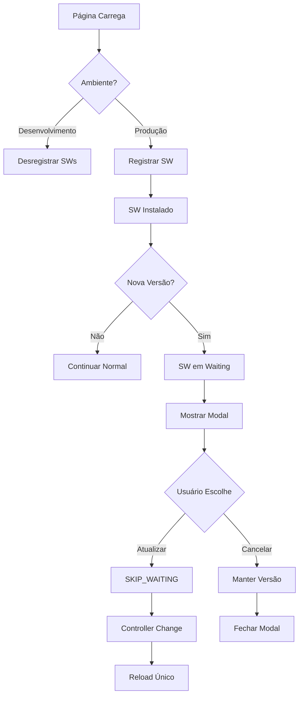

# Sistema de Service Worker - Melitus Gym

## Visão Geral

Implementação de um sistema de Service Worker controlado que resolve o problema de loops de "Nova versão disponível" e fornece um fluxo de atualização suave e controlado pelo usuário.

## Arquitetura

### Componentes Principais

1. **`lib/sw/register.ts`** - Registro e controle do Service Worker
2. **`components/UpdateModal.tsx`** - Modal de atualização com controle de versão
3. **`components/ServiceWorkerProvider.tsx`** - Provider que integra SW e modal
4. **`public/service-worker.js`** - Service Worker customizado
5. **`lib/sw/dev-utils.ts`** - Utilitários para desenvolvimento

### Fluxo de Funcionamento



## Características

### ✅ Problemas Resolvidos

- **Loop de "Nova versão disponível"** - Modal aparece apenas uma vez por versão
- **Reloads em cascata** - Apenas um reload controlado após atualização
- **SWs em desenvolvimento** - Desregistro automático em ambiente dev
- **Cache agressivo** - Headers apropriados para forçar verificação de atualizações

### 🔧 Funcionalidades

- **Registro condicional** - SW apenas em produção
- **Controle de versão** - Prevenção de prompts duplicados via localStorage
- **Atualização sob demanda** - SW não faz `skipWaiting()` automaticamente
- **Utilitários de debug** - Ferramentas para desenvolvimento e testes
- **Cache inteligente** - Network First para HTML, Cache First para assets

## Configuração

### Environment Variables

```env
NODE_ENV=production  # Para habilitar SW
```

### Next.js Headers

```javascript
// next.config.js
{
  source: '/service-worker.js',
  headers: [
    {
      key: 'Cache-Control',
      value: 'public, max-age=0, must-revalidate',
    },
    {
      key: 'Service-Worker-Allowed',
      value: '/',
    },
  ],
}
```

## Uso

### Integração Básica

```tsx
// app/layout.tsx
import { ServiceWorkerProvider } from '../components/ServiceWorkerProvider';

export default function RootLayout({ children }) {
  return (
    <ServiceWorkerProvider>
      {children}
    </ServiceWorkerProvider>
  );
}
```

### Desenvolvimento

```javascript
// Console do navegador

// Verificar status
swDevUtils.status();

// Limpar tudo
swDevUtils.clear();

// Forçar atualização
swDevUtils.update();
```

### Testes

```javascript
// Carregar script de teste
// Copie o conteúdo de scripts/test-sw.js no console

// Verificar status atual
swTest.test();

// Simular nova versão
swTest.simulate();

// Resetar tudo
swTest.reset();
```

## Fluxo de Atualização

### 1. Detecção de Nova Versão

```typescript
// Quando uma nova versão é detectada
reg.addEventListener('updatefound', () => {
  const newSW = reg.installing;
  newSW?.addEventListener('statechange', () => {
    if (newSW.state === 'installed' && navigator.serviceWorker.controller) {
      promptUpdate(newSW); // Mostrar modal
    }
  });
});
```

### 2. Controle de Versão

```typescript
function promptUpdate(worker: ServiceWorker) {
  // Garante que o prompt apareça uma única vez por versão
  const versionKey = `sw_prompted_${worker.scriptURL}`;
  if (localStorage.getItem(versionKey)) return;
  localStorage.setItem(versionKey, '1');
  onNewVersion?.();
}
```

### 3. Aplicação da Atualização

```typescript
// Usuário clica em "Atualizar"
window.dispatchEvent(new Event('sw-skip-waiting'));

// SW recebe mensagem
self.addEventListener('message', (event) => {
  if (event?.data?.type === 'SKIP_WAITING') {
    self.skipWaiting(); // Aplicar atualização
  }
});
```

### 4. Reload Controlado

```typescript
// Apenas um reload quando SW assume controle
navigator.serviceWorker.addEventListener('controllerchange', () => {
  if (refreshing) return;
  refreshing = true;
  window.location.reload();
});
```

## Estrutura de Arquivos

```
frontend/
├── lib/sw/
│   ├── register.ts      # Registro do SW
│   └── dev-utils.ts     # Utilitários de desenvolvimento
├── components/
│   ├── UpdateModal.tsx           # Modal de atualização
│   └── ServiceWorkerProvider.tsx # Provider principal
├── public/
│   └── service-worker.js         # Service Worker customizado
├── scripts/
│   └── test-sw.js               # Script de testes
└── docs/
    └── SERVICE_WORKER.md        # Esta documentação
```

## Debugging

### Console Logs

```javascript
// Service Worker
[SW] Installing version 2025-01-25-1
[SW] Activating version 2025-01-25-1
[SW] Received message: {type: 'SKIP_WAITING'}
[SW] Skipping waiting and taking control

// Cliente
[SW Provider] Nova versão detectada, abrindo modal
🛠️ Modo desenvolvimento: Service Workers serão desregistrados
💡 Use swDevUtils.status() para verificar o status dos SWs
```

### DevTools

1. **Application > Service Workers** - Verificar status dos SWs
2. **Application > Storage** - Verificar localStorage e caches
3. **Network** - Verificar requisições do SW
4. **Console** - Usar utilitários de debug

## Testes

### Ambiente de Desenvolvimento

```bash
# Verificar que SWs são desregistrados
npm run dev
# Abrir DevTools > Application > Service Workers
# Deve estar vazio
```

### Ambiente de Produção

```bash
# Build e start
npm run build
npm start

# Abrir http://localhost:3000
# Verificar que SW foi registrado
# Fazer alteração no SW_VERSION
# Rebuild e verificar modal de atualização
```

### Cenários de Teste

1. **Primeira visita** - SW deve ser registrado sem modal
2. **Nova versão** - Modal deve aparecer uma vez
3. **Atualizar** - Reload único após confirmação
4. **Cancelar** - Modal não deve reaparecer
5. **Desenvolvimento** - SWs devem ser desregistrados

## Troubleshooting

### Modal não aparece

- Verificar se está em produção (`NODE_ENV=production`)
- Verificar se há SW em waiting (`swDevUtils.status()`)
- Verificar localStorage (`sw_prompted_*`)

### Loop de reloads

- Verificar se `skipWaiting` não está sendo chamado automaticamente
- Verificar flag `refreshing` no registro
- Limpar tudo e recomeçar (`swDevUtils.clear()`)

### SW não atualiza

- Verificar headers de cache do `/service-worker.js`
- Forçar atualização (`swDevUtils.update()`)
- Verificar se `SW_VERSION` foi alterada

## Manutenção

### Atualizando a Versão

```javascript
// public/service-worker.js
const SW_VERSION = '2025-01-25-2'; // Incrementar a cada release
```

### Limpeza Periódica

```javascript
// Remover chaves antigas do localStorage
Object.keys(localStorage)
  .filter(key => key.startsWith('sw_prompted_'))
  .filter(key => /* lógica de data antiga */)
  .forEach(key => localStorage.removeItem(key));
```

## Referências

- [Service Worker API](https://developer.mozilla.org/en-US/docs/Web/API/Service_Worker_API)
- [Workbox](https://developers.google.com/web/tools/workbox)
- [PWA Update Patterns](https://web.dev/service-worker-lifecycle/)